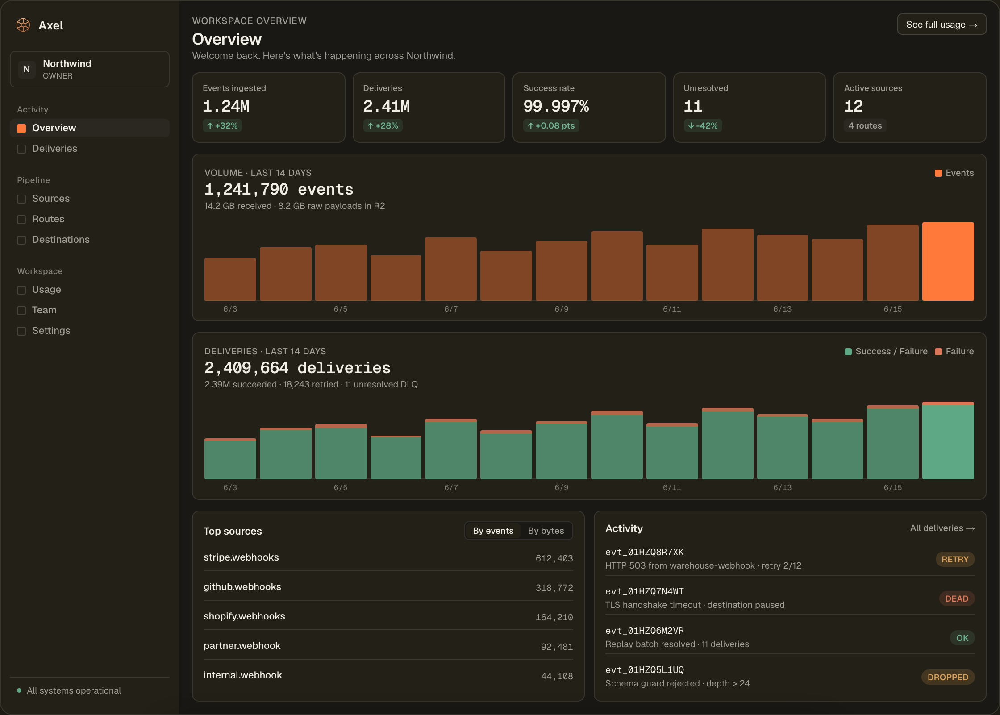

# Axel

Open-source webhook ingestion and event delivery platform. Capture webhooks
from any source, filter and transform them with declarative routes, and
deliver them to HTTP endpoints, Postgres, MongoDB, BigQuery, Databricks, or
object storage, with retries, dead-lettering, replay, and delivery tracking.

**[Start on Axel Cloud](https://app.axelapp.ai/signup)** to send your first
webhook without deploying the stack. We run the infrastructure, updates, and
delivery monitoring. Cloud includes 30 days of searchable event and delivery
history. Start with 10,000 accepted inbound events per month free, then move to
Pro with a $20 monthly usage credit. See [Cloud pricing](https://axelapp.ai/pricing).

Prefer to run it yourself? The same application code is available under
Apache-2.0, including the connectors, routing, retries, and replay. Follow the
[self-hosting guide](docs/self-hosting.md) for the Docker and Cloudflare setup.
You operate the infrastructure and upgrades. The small profile omits ClickHouse;
add it when you need analytics-backed search and usage views.

> Axel is pre-1.0. Expect configuration and API changes between minor releases.
> Release notes will call out required migration steps.



## How it works

```
                    ┌──────────────────────────── Cloudflare ───────────────────────────┐
Webhook sources ──▶ │ ingest-worker ─▶ R2 (raw payloads) + sharded Queues               │
                    │      └─▶ router-edge (route eval, fan-out) ─▶ delivery queues     │
                    │               └─▶ delivery-edge (HTTP / webhook / R2 / S3)        │
                    └────────────────────────────────────────────────────────────────────┘
                                   └─▶ delivery-service (Node): Postgres / MongoDB /
                                       BigQuery / Databricks destinations
Control plane:  dashboard (Next.js) + Postgres (config, users) + ClickHouse (delivery logs)
Pull sources:   pull-worker polls APIs (e.g. Stripe) and feeds the same pipeline
```

Custom webhook sources send their one-time token only in the `x-axel-token`
request header. Ingest rejects source credentials in URL query parameters.
Stripe, GitHub, Shopify, and Chargebee sources use their provider-native
authentication without an Axel source token.

Current runtime boundaries are in [`docs/adr-0002-current-runtime.md`](docs/adr-0002-current-runtime.md)
and [`docs/production-scale.md`](docs/production-scale.md).

## Repo layout

| Path                     | What lives here                                            |
| ------------------------ | ---------------------------------------------------------- |
| `apps/ingest-worker`     | Cloudflare Worker for the public webhook ingest endpoint  |
| `apps/router-edge`       | Cloudflare Worker for route evaluation and fan-out         |
| `apps/delivery-edge`     | Cloudflare Worker for HTTP/webhook/R2/S3 delivery and DLQ  |
| `apps/delivery-service`  | Node service for Postgres, MongoDB, BigQuery, and Databricks delivery |
| `apps/pull-worker`       | Node service that polls pull-based sources                 |
| `apps/dashboard`         | Next.js control plane (auth, routes, replay, admin)        |
| `apps/marketing`         | Marketing + public docs site                               |
| `packages/shared`        | Shared types, contracts, credential crypto                 |
| `packages/connectors`    | Destination connectors                                     |
| `packages/pull-connectors` | Pull-source connectors                                   |
| `packages/cli`           | Axel CLI source; the npm package is not published yet      |
| `infra/`                 | Postgres migrations, ClickHouse schema, lifecycle rules    |
| `docs/`                  | ADRs and operational runbooks                              |

## Development

Requires Node 22.13+ on the Node 22 LTS line (CI uses the exact version in
`.node-version`) and pnpm 9. `jq` is needed for the deploy-script tests in
`pnpm test`.

```sh
corepack enable
corepack prepare pnpm@9.12.0 --activate
pnpm install --frozen-lockfile
pnpm build       # builds workspace packages (required before tests)
pnpm test
pnpm lint
pnpm typecheck

# Full local verification, including disposable ClickHouse and browser checks:
pnpm exec playwright install chromium
pnpm verify
```

The full verification command also requires Docker and jq. See [AGENTS.md](AGENTS.md)
for focused checks, isolated worktrees, and separate browser-test ports.

For a signed-in dashboard with synthetic data, run `pnpm qa:dashboard` in a clean
worktree without local environment files. It builds the app, starts a disposable
Postgres database, and prints the local URL and test credentials. Ctrl-C removes
the database. `pnpm test:dashboard` runs the same setup with browser checks for
login, a persisted workspace edit, source navigation, tenant isolation, and logout
at desktop and mobile sizes in both themes. No hosted credentials are needed.

Raw local backing stores for database-specific development:

```sh
docker compose up -d
```

That development Compose file does not create Axel's protected database roles
or application schema. Use the self-host profile below when you need a migrated
Postgres database with the dashboard and delivery service; its `up` command
performs the supported bootstrap automatically.

Per-app dev servers:

```sh
pnpm --filter @axel/dashboard dev       # control plane on :3000
pnpm --filter @axel/marketing dev       # marketing site on :3001
pnpm --filter @axel/ingest-worker dev   # wrangler dev
```

Use `.env.example` as the starting configuration template. Individual services
also expose workload-specific tuning settings next to their implementation.
Put Next.js values in the relevant app's `.env.local` (for example,
`apps/dashboard/.env.local`), put local Worker values in that app's `.dev.vars`,
and export variables before running root shell scripts. The optional
integrations degrade gracefully when unset: no Stripe means no billing or caps,
no Resend means no emails, and no Sentry means no error telemetry.

## Self-hosting

The low-volume self-host profile uses Cloudflare's free Workers, Queues, and R2
allowances plus one Docker host you already control. It collapses the 16
production ingest queues to one queue and sends every destination through one
Node delivery service. Postgres, migrations, dashboard, cron, delivery, and
Caddy all run in the included Compose stack. The `up` command also creates
separate Postgres bootstrap, migration, owner, and runtime roles before the
long-running services start.

```sh
AXEL_PUBLIC_URL=https://axel.example.com \
AXEL_SITE_ADDRESS=axel.example.com \
  ./scripts/axel-self-host init

# Add CLOUDFLARE_ACCOUNT_ID, CLOUDFLARE_API_TOKEN, and the narrower
# CLOUDFLARE_RUNTIME_API_TOKEN to .env.selfhost.
./scripts/axel-self-host edge
./scripts/axel-self-host up
```

This can have a $0 cloud bill when it runs on an existing machine, within the
provider's free limits. It is not a promise of free hardware, a free domain, or
an always-on managed database. See [`docs/self-hosting.md`](docs/self-hosting.md)
for the limits, token permissions, backups, and production topology.

## Documentation and support

- [`docs/self-hosting.md`](docs/self-hosting.md) covers installation, backups,
  upgrades, and the differences from Axel Cloud.
- [`apps/dashboard/public/openapi.yaml`](apps/dashboard/public/openapi.yaml) is
  the public API contract.
- [`docs/postman/README.md`](docs/postman/README.md) explains the example
  Postman collection and environment.
- [`packages/cli/README.md`](packages/cli/README.md) documents the CLI source.
  The npm package is not published yet.

Ask usage questions in [GitHub Discussions](https://github.com/rolln-ai/axel/discussions).
See [`SUPPORT.md`](SUPPORT.md) before posting logs or diagnostic data.

## Contributing

See [`CONTRIBUTING.md`](CONTRIBUTING.md),
[`CODE_OF_CONDUCT.md`](CODE_OF_CONDUCT.md), and
[`GOVERNANCE.md`](GOVERNANCE.md). Security reports belong in the private
channels described by [`SECURITY.md`](SECURITY.md). The latest webhook data-flow review and open
hardening backlog are in
[`docs/security-review-2026-08.md`](docs/security-review-2026-08.md).

## License

Axel is free to use, modify, and distribute, including commercially, under the
[Apache License 2.0](LICENSE). You may run it privately, offer a hosted version,
or distribute your own builds. Axel Cloud has separate hosted-service terms.
The source license does not grant rights to the Axel or rolln trademarks; see
[`TRADEMARKS.md`](TRADEMARKS.md). Third-party notices are in
[`THIRD_PARTY_NOTICES.md`](THIRD_PARTY_NOTICES.md).
